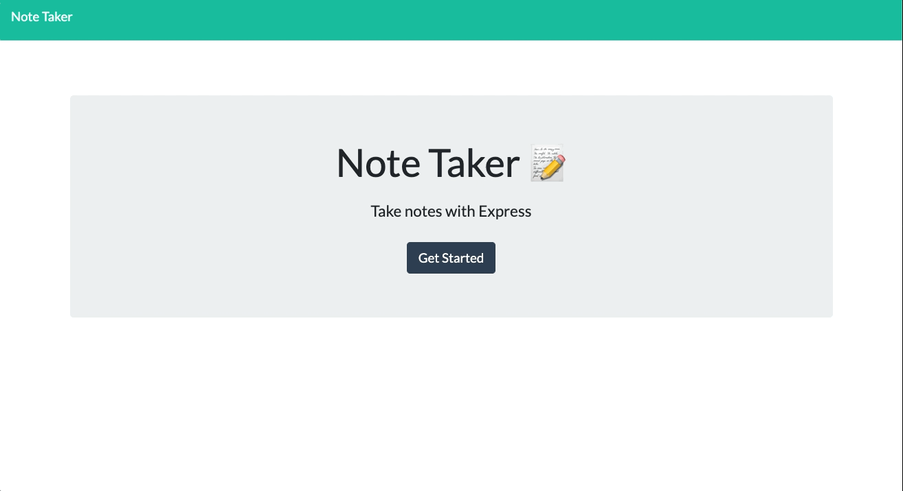
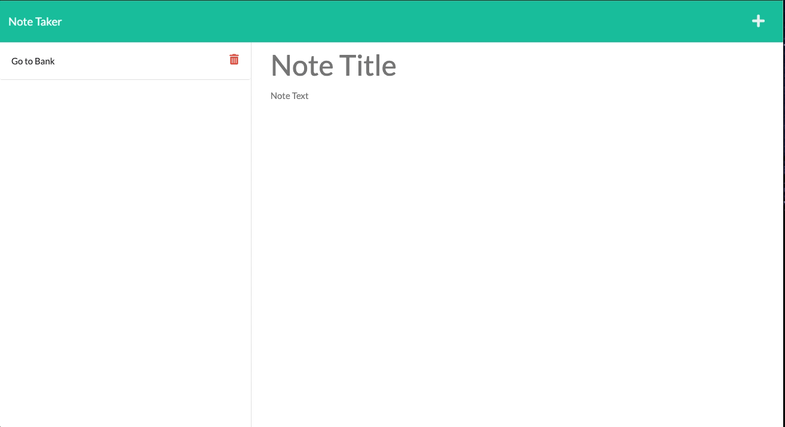
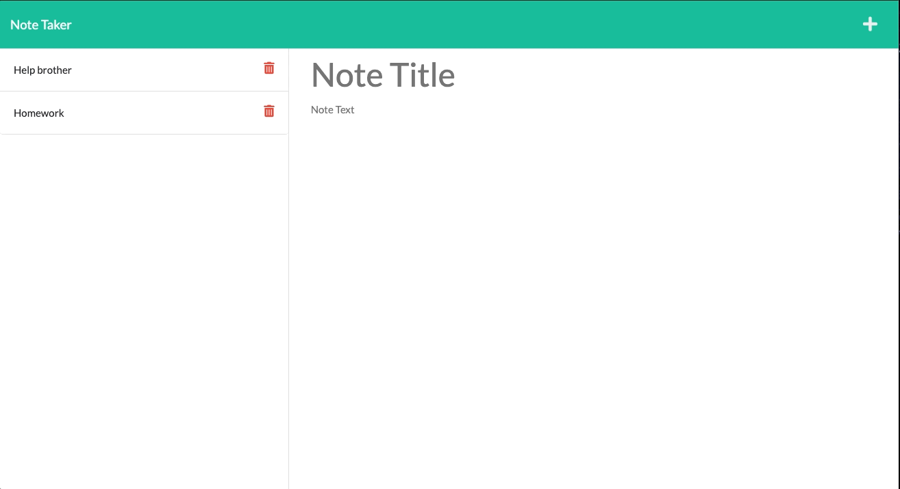

# Note Taker

 

## Description

A Note Taker application that allows the user to view existing notes, add new notes and delete current notes.  This project utilizes Get, Post and Delete requests to allow the user to see past notes, add new notes, and delete completed notes.

## Table of Contents 

- [About the Project](#about-the-project)
- [Installation](#installation)
- [Usage](#usage)
- [Contributing](#contributing)
- [Tests](#tests)
- [License](#license)
- [Questions](#questions)

## About the Project

- Created to allow the user to add, view and delete existing notes.
- The Note Take application is deplopyed using [Heroku](https://dry-ocean-87387.herokuapp.com/).
- This application utilizes the following npm packages: \
      - [fs](https://www.npmjs.com/package/fs) \
      - [path](https://www.npmjs.com/package/path) \
      - [express](https://www.npmjs.com/package/express) \
      - [uuid](https://www.npmjs.com/package/uuid) \
      - [nodemon](https://www.npmjs.com/package/nodemon) 
- Used Get, Post and Delete requests to create this application.

## Installation

- [git clone from github](https://github.com/twashke/Note-Taker) 
- npm install (to install dependencies)
- npm start (to start server)
- [Local Host Internet Connetion](http://localhost:3001/) 

## Usage

- [Deployed Heroku App](https://dry-ocean-87387.herokuapp.com/)
- Opens at the home page, click Get Started to open the notes application.
- To add a new note, press the + button on the top right side.
- Enter a note title and note text and click save, the notes will be saved on the left side of the screen.
- To view a past note, click on it to bring it to the main screen.
- To delete a note, click on the trash icon next to the note to be deleted.

Entering Application and Adding Notes
 

Adding More Notes
 

Viewing and Deleting Notes
 

Deleting Notes
 

## Contributing

- Front end code provided for project.
- Troubleshooting help by [Joshua Washke](https://github.com/jwashke)

## Tests

- Used [Insomina](https://insomnia.rest/) to test requests to server prior to deploying.

## License

This application is covered by the [MIT License](https://opensource.org/licenses/MIT). 
       
      Copyright 2021 Tiffany Washke

      Permission is hereby granted, free of charge, to any person obtaining a copy of this software and associated documentation files (the "Software"), to deal in the Software without restriction, including without limitation the rights to use, copy, modify, merge, publish, distribute, sublicense, and/or sell copies of the Software, and to permit persons to whom the Software is furnished to do so, subject to the following conditions:
      
      The above copyright notice and this permission notice shall be included in all copies or substantial portions of the Software.
      
      THE SOFTWARE IS PROVIDED "AS IS", WITHOUT WARRANTY OF ANY KIND, EXPRESS OR IMPLIED, INCLUDING BUT NOT LIMITED TO THE WARRANTIES OF MERCHANTABILITY, FITNESS FOR A PARTICULAR PURPOSE AND NONINFRINGEMENT. IN NO EVENT SHALL THE AUTHORS OR COPYRIGHT HOLDERS BE LIABLE FOR ANY CLAIM, DAMAGES OR OTHER LIABILITY, WHETHER IN AN ACTION OF CONTRACT, TORT OR OTHERWISE, ARISING FROM, OUT OF OR IN CONNECTION WITH THE SOFTWARE OR THE USE OR OTHER DEALINGS IN THE SOFTWARE.

## Questions

**Contact Tiffany Washke**

- **Email directly at** twashke@gmail.com
- **GitHub User Name:** [twashke](https://github.com/twashke)

 

